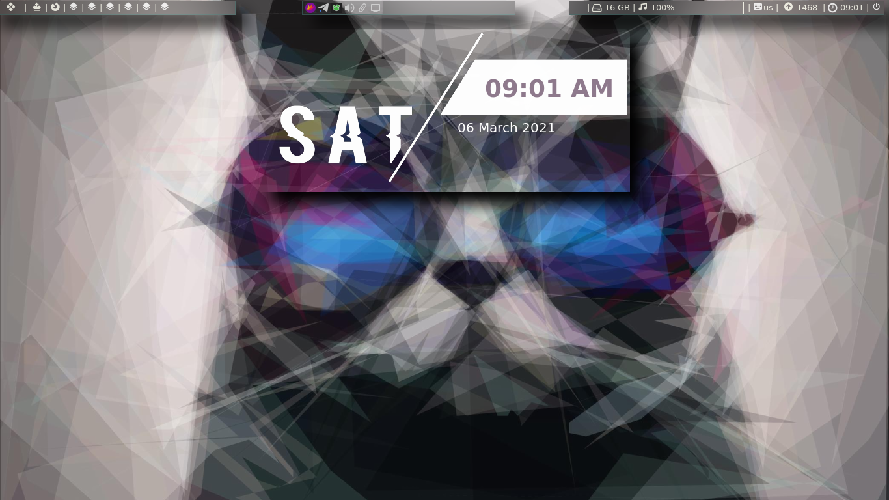

# mxtest-dope-dots




## Initial step
```
mkdir ~/gitall
mkdir ~/pix
mkdir ~/pix/wall
cd ~/gitall
git clone https://gitlab.com/only_vip/mxtest-dope-dots.git
```
## Things to delete from mx after first install
```
sudo aptitude remove vim-tiny vim-common asunder bluetooth clementine gimp gimp-data gimp-python libgimp2.0 simple-scan gscan2pdf hexchat lbreakout2 gnome-mahjongg mc mc-data nomacs nomacs-l10n thunderbird transmission-gtk transmission-common xfburn papirus-icon-theme
```
## Things to install later
### Fonts
```
sudo aptitude install fonts-noto-color-emoji fonts-noto-color-emoji fonts-symbola node-emojis-list ttf-ancient-fonts-symbola fonts-fork-awesome nordic-themes fonts-powerline fonts-roboto fonts-roboto-fontface fonts-ubuntu ttf-ubuntu-font-family fonts-font-awesome fonts-fork-awesome
```
### Dependencies and apps
```
sudo aptitude install vim cmake  bspwm sxhkd lxappearance polybar fzf evince w3m w3m-img youtube-dl lolcat arandr nitrogen sxiv mpv x11-utils mpd mpc ncmpcpp pylint dmenu netcat jq ffmpeg caca-utils chafa libsixel1 flameshot libsixel-bin qbittorrent uget qutebrowser rofi rofi-calc network-manager git curl wget tree libreadline-dev xattr zathura zathura-cb zathura-djvu zathura-pdf-poppler zathura-ps python3-setuptools python3-dev python3-pip atool bsdtar rar moc mediainfo exiftool odt2txt rtorrent python3-wheel python3-docopt rxvt-unicode-256color

```


### Compton dependencies
```
sudo aptitude install libx11-dev libxcomposite-dev libxdamage-dev libxfixes-dev libxext-dev libxrender-dev libxrandr-dev libxinerama-dev pkg-config make libpcre2-dev libconfig-dev libdrm-dev  libx11-dev libxcomposite-dev libxdamage-dev libxfixes-dev libxext-dev libxrender-dev libxrandr-dev libxinerama-dev pkg-config make libpcre2-dev libconfig-dev libdrm-dev libdbus-1-dev  libgl-dev libpcre++-dev docbook-xml libxslt1-dev xsltproc xmlto asciidoc-base asciidoc-common xsltproc libxcb-image0-dev libxcb-damage0-dev  libpixman-1-dev  dmenu asciidoc

```

### Picom dependencies
```
sudo aptitude install meson libxext-dev libxcb1-dev libxcb-damage0-dev libxcb-xfixes0-dev libxcb-shape0-dev libxcb-render-util0-dev libxcb-render0-dev libxcb-randr0-dev libxcb-composite0-dev libxcb-image0-dev libxcb-present-dev libxcb-xinerama0-dev libpixman-1-dev libdbus-1-dev libconfig-dev libgl1-mesa-dev  libpcre2-dev  libevdev-dev uthash-dev libev-dev libpcre++-dev  libx11-xcb-dev
```

### All github links
```
cd ~/gitall
git clone https://github.com/alexanderjeurissen/ranger_devicons
git clone https://github.com/lincheney/fzf-tab-completion
git clone https://gitlab.com/dwt1/shell-color-scripts
git clone https://github.com/ryanoasis/vim-devicons
git clone https://github.com/tryone144/compton
git clone https://github.com/jonaburg/picom
git clone https://github.com/ranger/ranger
git clone https://github.com/siduck76/st
git clone https://github.com/jarun/nnn
```

##### Remove this patch later

```
https://st.suckless.org/patches/bold-is-not-bright/
```
### [starship-prompt.rs](https://starship.rs/)

# Install starship
`curl -fsSL https://starship.rs/install.sh | bash`

## Get a nerd font
[Nerd-fonts](https://www.nerdfonts.com/)

### libreoffice appimage
[Libreoffice-appimage](https://www.libreoffice.org/download/appimage/)


## Install nnn with icon fonts 
```
cd nnn 
make
sudo make O_NERD=1
sudo make install install-desktop
```

## Sid's st deps
```
sudo aptitude install libxft-dev libx11-dev libharfbuzz-dev libxext-dev libxrender-dev libxinerama-dev

```


## Install shell color scripts
```
cd ~/gitall/shell-color-scripts
rm -rf /opt/shell-color-scripts || return 1
sudo mkdir -p /opt/shell-color-scripts/colorscripts || return 1
sudo cp -rf colorscripts/* /opt/shell-color-scripts/colorscripts
sudo cp colorscript.sh /usr/bin/colorscript
```
## Install picom
```
cd ~/gitall/picom
meson --buildtype=release . build
ninja -C build
```

### To install the binaries of picom in /usr/local/bin (optional)

```
sudo ninja -C build install
```


## Copy rsfetch,viman and atomicparsley to /usr/bin
```
sudo cp ~/copytousrbinlocal/* /usr/bin/
```

### Reload font cache after copying the fonts folder to ~/.fonts/*

```
fc-cache -fv
```

## Get pywal,colorz,schemer2,ueberzug.

```
pip3 install pywal colorz ueberzug
```
## get updated fzf from github, get tmux from bpo
```
git clone --depth 1 https://github.com/junegunn/fzf.git ~/.fzf
~/.fzf/install
```
###### run `~/.fzf/install` as sudo `sudo ~/.fzf/install` to have it detected everywhere in your system


## Install papirus icon theme
### Papirus Installer

### Use the scripts to install the latest version directly from their github repo (independently of your distro):

##### NOTE: Use the same script to update icon themes.
### ROOT directory (recommended)
```
wget -qO- https://git.io/papirus-icon-theme-install | sh
```
### HOME directory for GTK
```
wget -qO- https://git.io/papirus-icon-theme-install | DESTDIR="$HOME/.icons" sh
```
### HOME directory for KDE
```
wget -qO- https://git.io/papirus-icon-theme-install | DESTDIR="$HOME/.local/share/icons" sh
```
### *BSD systems
```
wget -qO- https://git.io/papirus-icon-theme-install | env DESTDIR="/usr/local/share/icons" sh
```
### Uninstall
```
wget -qO- https://git.io/papirus-icon-theme-uninstall | sh
```
### Papirus-folder install
##### Use the script to install the latest version directly from their github repo (independently on your distro):

Install
```
wget -qO- https://git.io/papirus-folders-install | sh
```

#### To install papirus-folders on BSD systems using the following command:
```
wget -qO- https://git.io/papirus-folders-install | env PREFIX=/usr/local sh
```
#### Uninstall
```
wget -qO- https://git.io/papirus-folders-install | env uninstall=true sh
```


## Install dunst
```
cd ~/gitall
git clone https://github.com/dunst-project/dunst.git
cd dunst
sudo aptitude install libnotify-dev libxss-dev libxdg-basedir-dev libghc-pango-dev
make PREFIX=/usr WAYLAND=0
sudo make install PREFIX=/usr WAYLAND=0
sudo apt remove xfce4-notifyd
```
## Install rustup
```
curl --proto '=https' --tlsv1.2 -sSf https://sh.rustup.rs | sh

```
#### Install bat,exa from cargo
```
cargo install bat exa
```
### change crontab entry to have wal run every 10 minutes
run `crontab -e` enter following command at the end
```
*/10 * * * * DISPLAY=:0 ~/.local/bin/wal -a "50" backend colorz -i $(find ~/wals/* | shuf | head -n 1)
```

### misc. links
[Bgra-debian](https://github.com/ra-c/libxft-bgra-debian)\
[nnn-livepreview](https://github.com/jarun/nnn/wiki/Live-previews)\
[For-art-downloading-in-ytdl,atomicparsley](https://github.com/wez/atomicparsley)\
[SACAD,SmartAutomaticCoverArtDownloader](https://github.com/desbma/sacad)\
[Termite-terminal-install-guide](https://epsi-rns.github.io/desktop/2016/09/19/termite-install.html)\
[vimwiki](https://cristianpb.github.io/vimwiki/st/)\
[ytfzf](https://github.com/pystardust/ytfzf)\
[Suckless-tabbed](https://tools.suckless.org/tabbed/)


### ~~termite is deprecated but the install script is still here just for nostalgia~~
~~### termite install~~


mkdir ~/git-src
cd ~/git-src

sudo apt install gtk-doc-tools valac libgirepository1.0-dev libgtk-3-dev libgnutls28-dev intltool libxml2-utils gperf

git clone https://github.com/thestinger/vte-ng.git

cd vte-ng

git cherry-pick 53690d5c

./autogen.sh

make

sudo make install

cd ~/git-src
git clone --recursive https://github.com/thestinger/termite.git
cd termite
make
sudo make install

cd ~/git-src/vte-ng
sudo make uninstall~~

~~for saner working of termite~~

```
wget https://raw.githubusercontent.com/thestinger/termite/master/termite.terminfo
tic -x termite.terminfo
```
