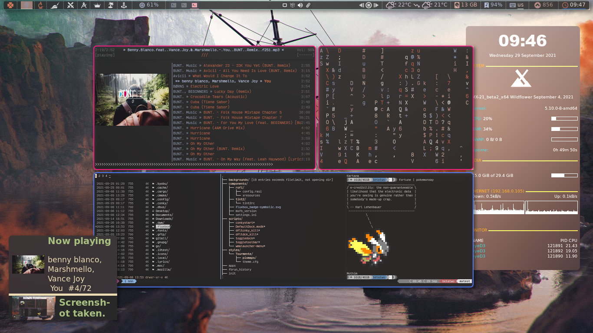

# mxtest-dope-dots




## Initial step
```
mkdir ~/.gitall
mkdir ~/.pix
mkdir ~/.pix/wall
mkdir ~/.mpr
mkdir `/.walls
cd ~/.gitall
git clone https://gitlab.com/only_vip/mxtest-dope-dots.git
```
#### copy all the contents of mxtest-dope-dots to ~ excluding README, .git and license.
## Things to delete from mx after first install
```
sudo aptitude remove vim-tiny vim-common asunder bluetooth clementine simple-scan gscan2pdf hexchat lbreakout2 gnome-mahjongg mc mc-data nomacs nomacs-l10n thunderbird transmission-gtk transmission-common xfburn
```
## Things to install later
### Fonts
```
sudo aptitude install fonts-noto-color-emoji fonts-noto-color-emoji fonts-symbola node-emojis-list ttf-ancient-fonts-symbola fonts-fork-awesome fonts-powerline fonts-roboto fonts-roboto-fontface fonts-ubuntu ttf-ubuntu-font-family fonts-font-awesome fonts-fork-awesome fonts-material-design-icons-iconfont
```
### Dependencies and apps
```
sudo aptitude install vim cmake lxappearance fzf w3m w3m-img lolcat arandr nitrogen sxiv mpv x11-utils mpd mpc ncmpcpp pylint dmenu netcat jq ffmpeg caca-utils chafa libsixel1 flameshot libsixel-bin qbittorrent uget network-manager git curl wget tree libreadline-dev xattr zathura zathura-cb zathura-djvu zathura-pdf-poppler zathura-ps python3-setuptools python3-dev python3-pip atool rar moc mediainfo exiftool odt2txt rtorrent python3-wheel python3-docopt tmux python3-ueberzug ripgrep fd-find eyed3 python3-pylast lxpolkit dvisvgm roxterm atomicparsley ncat emacs emacs-gtk i3lock i3lock-fancy

```
## setup [MPR](https://mpr.hunterwittenborn.com/packages/mpm)
>First, add the signing key:

```
wget -qO - 'https://proget.hunterwittenborn.com/debian-feeds/makedeb.pub' | \
gpg --dearmor | \
sudo tee /usr/share/keyrings/makedeb-archive-keyring.gpg &> /dev/null
```
>Next, add the repository information to your system:

```
echo 'deb [signed-by=/usr/share/keyrings/makedeb-archive-keyring.gpg arch=all] https://proget.hunterwittenborn.com/ makedeb main' | \
sudo tee /etc/apt/sources.list.d/makedeb.list
```
>Lastly, update the repository cache on your system:

```
sudo apt update && sudo apt install makedeb
```

install from mpr

1. tap
```
cd ~/.gitall
git clone https://mpr.hunterwittenborn.com/tap.git
cd tap
makedeb -si
sudo tap update
```
#### optional prebuilt-mpr similar to chaotic aur for mpr

ADD dependencies,
```
sudo apt install -y debian-keyring debian-archive-keyring apt-transport-https
```
add gpg key
```
curl -1sLf 'https://dl.cloudsmith.io/public/prebuiltmpr/prebuiltmpr/gpg.96BF50280AB09218.key' | sudo apt-key add -
```
add repo
```
curl -1sLf 'https://dl.cloudsmith.io/public/prebuiltmpr/prebuiltmpr/config.deb.txt?distro=debian&codename=bullseye' | sudo tee /etc/apt/sources.list.d/prebuiltmpr.list
```

### Later on use tap to install from MPR.
```
sudo tap install libptytty-bin && sudo tap install bat-cat-bin exa-bin picom-git dunst foot-bin neofetch-git neovim-git nerd-fonts-victor-mono ntfd rofi rxvt-unicode-256color shell-color-scripts nerd-fonts-jetbrains-mono ttf-weather-icons-bin ungoogled-chromium-linchrome-bin yt-dlp-bin ytfzf polybar bspwm-git bsptab-git sxhkd-git lemonbar-xft-git starship-bin
```
### misc stuff you can get from MPR
```
sudo tap install rl-custom-function-git reproc &&
sudo tap install fzf-tab-completion-git st-siduck76-git lite-xl polybar urxvt-config-git compix-git koreader-bin  i3-gaps-git awesome-git projectlibre-bin siji-git cbonsai-git zentile-bin ntfd nerd-fonts-ricty nnn-git tdrop-git bsptab-git zotero &&
sudo tap instal epy-git castero-git mangohud chadwm-git pokemonsay-newgenerations-git micro-git xfwm-effects musikcube-bin rum-bin lossless-cut-bin
```

### install compton or picom any one
>`sudo tap install compton-tryone-git` or 
>`sudo tap instal picom-git`or
>`sudo tap install picom-jonaburg-fix-git`
>`sudo tap install compix-git`

## Get a nerd font
[Nerd-fonts](https://www.nerdfonts.com/)

## Get pywal,colorz,schemer2,ueberzug.
```
pip3 install pywal colorz
```

### Reload font cache after copying the fonts folder to ~/.fonts/*
```
fc-cache -frv
```

### install texlive
```
sudo apt install texlive-full
```
### get digestif
```
~/.scripts/digestif
```

## Install papirus icon theme
### Papirus Installer

### Use the scripts to install the latest version directly from their github repo (independently of your distro):

##### NOTE: Use the same script to update icon themes.
### ROOT directory (recommended)
```
wget -qO- https://git.io/papirus-icon-theme-install | sh
```
### HOME directory for GTK
```
wget -qO- https://git.io/papirus-icon-theme-install | DESTDIR="$HOME/.icons" sh
```
### HOME directory for KDE
```
wget -qO- https://git.io/papirus-icon-theme-install | DESTDIR="$HOME/.local/share/icons" sh
```
### *BSD systems
```
wget -qO- https://git.io/papirus-icon-theme-install | env DESTDIR="/usr/local/share/icons" sh
```
### Uninstall
```
wget -qO- https://git.io/papirus-icon-theme-uninstall | sh
```
### Papirus-folder install
##### Use the script to install the latest version directly from their github repo (independently on your distro):

Install
```
wget -qO- https://git.io/papirus-folders-install | sh
```

#### To install papirus-folders on BSD systems using the following command:
```
wget -qO- https://git.io/papirus-folders-install | env PREFIX=/usr/local sh
```
#### Uninstall
```
wget -qO- https://git.io/papirus-folders-install | env uninstall=true sh
```

### change crontab entry to have wal run every 10 minutes
run `crontab -e` enter following command at the end
```
*/30 * * * * DISPLAY=:0 ~/.local/bin/wal -a "50" --backend colorz -i $(find ~/.wals/* | shuf | head -n 1)
```
### install ntfd

>change the `~/.config/polybar/config` module-right to include the weather module. 
### make tmux symlink
> make a symlink of the tmux config    `ln -s -f ~/.tmux/.tmux.conf ~/.tmux.conf`
> make a symlink of ~/.cache/wal/colors.Xresources `ln -s -f ~/.cache/wal/colors.Xresources`

### NOTE: Change monitor in .config/polybar/config file to your monitor name. find it by running `xrandr` in a terminal. otherwise polybar wont work
### NOTE: if urxvt is built with 256color enabled then change xresources file as well.


### misc. links
[Bgra-debian](https://github.com/ra-c/libxft-bgra-debian)\
[nnn-livepreview](https://github.com/jarun/nnn/wiki/Live-previews)\
[For-art-downloading-in-ytdl,atomicparsley](https://github.com/wez/atomicparsley)\
[SACAD,SmartAutomaticCoverArtDownloader](https://github.com/desbma/sacad)\
[Termite-terminal-install-guide](https://epsi-rns.github.io/desktop/2016/09/19/termite-install.html)\
[vimwiki](https://cristianpb.github.io/vimwiki/st/)\
[ytfzf](https://github.com/pystardust/ytfzf)\
[Suckless-tabbed](https://tools.suckless.org/tabbed/)
[Rsfetch](https://github.com/Phate6660/rsfetch)

### ~~termite is deprecated but the install script is still here just for nostalgia~~
~~### termite install~~


mkdir ~/git-src
cd ~/git-src

sudo apt install gtk-doc-tools valac libgirepository1.0-dev libgtk-3-dev libgnutls28-dev intltool libxml2-utils gperf

git clone https://github.com/thestinger/vte-ng.git

cd vte-ng

git cherry-pick 53690d5c

./autogen.sh

make

sudo make install

cd ~/git-src
git clone --recursive https://github.com/thestinger/termite.git
cd termite
make
sudo make install

cd ~/git-src/vte-ng
sudo make uninstall

~~for saner working of termite~~

```
wget https://raw.githubusercontent.com/thestinger/termite/master/termite.terminfo
tic -x termite.terminfo
```
